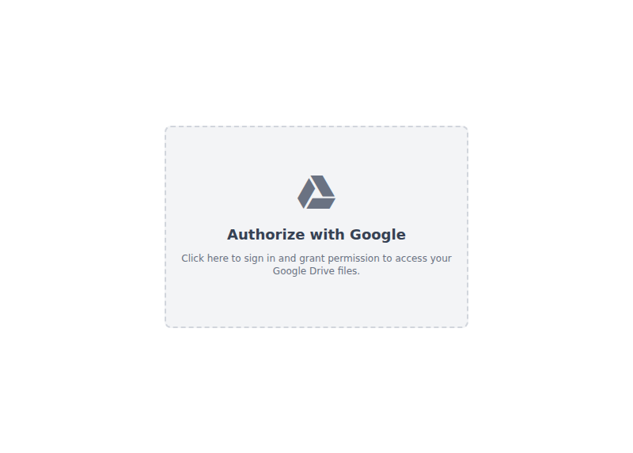

# mfm-gdrive
Easy rename your files in Google Drive

## How to Use
1. **Download the Application:**
   - Download the latest version of the application for your operating system from the [releases page](https://github.com/dhanyn10/mfm-gdrive/releases).

2. **Run the Application:**
   - **Windows:** Double-click the downloaded `.exe` file.
   - **macOS:** Open the downloaded `.dmg` file and drag the application to your `Applications` folder.
   - **Linux:** Double-click the downloaded `.deb` file to install.

3. **Authorize with Google Drive:**
   - When you first launch the application, you'll see an "Authorize" button. Click it to allow the app to access your Google Drive files.
   - 

4. **Navigate Your Files:**
   - The left sidebar shows your folder structure.
   - The right sidebar displays the files and folders within the selected folder.
   - To go back to the parent folder, click the "..." entry.

5. **Rename Files:**
   - Select the files you want to rename. You can select multiple files by holding `Shift` and clicking.
   - Click the "Play" button to open the renaming options.

## Renaming Features

### Change Filename by Name
- This feature allows you to replace a specific string in the filenames.
- For example, if you have files named `my-file-1.pdf`, `my-file-2.pdf`, etc., you can replace `my` with `our` to rename them to `our-file-1.pdf`, `our-file-2.pdf`, and so on.

### Change Filename by Position
- This feature removes characters from the filename based on their position.
- You'll be prompted to enter a `start` and `end` position, and all characters within that range will be removed.

### Insert PadStart
- This feature adds padding to the beginning of a string until it reaches a certain length.
- For example, if you have `file-997.pdf`, `file-998.pdf`, etc., you can set the expected length to `4` to rename them to `file-0997.pdf`, `file-0998.pdf`, etc. You can read more about `padStart` [here](https://developer.mozilla.org/en-US/docs/Web/JavaScript/Reference/Global_Objects/String/padStart).
